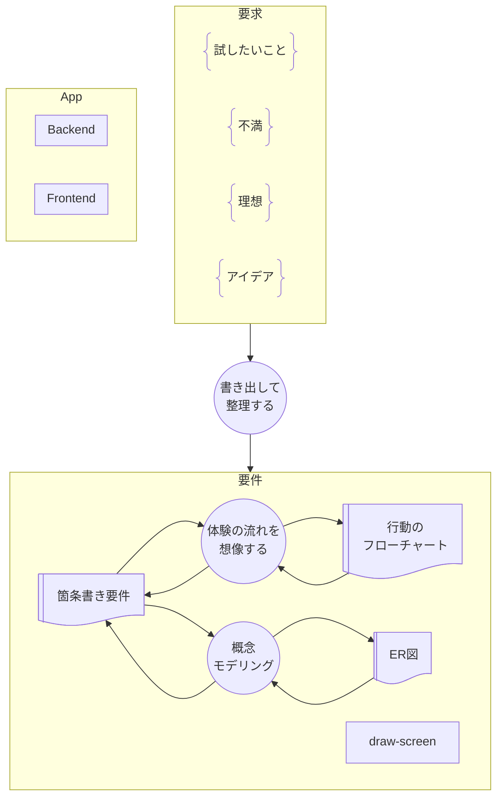

# 開発の流れメモ

## Process Flow Diagram

## 1. 要求定義

- やりたいこと・不満なこと・良いなと思うことを書き出すだけ。
- 目的の大元を言語化する。
- AI には言語化の壁打ちになってもらう。
- `output`
  - 要求一覧(markdown)

## 2. 要件定義・基本設計

- 要求に対する実現可能性を考える。
- どこまでやるか
- AI に聞く。技術スタックとか、実現の方針とか。
- `output`
  - 技術スタック(markdown)
  - 要件一覧(markdown)
  - ER 図(mermaid)
  - 行動のフローチャート(mermaid)
  - 画面遷移図(drawio)
  - 実装計画ガントチャート(mermaid)

## 3. 詳細設計・開発・テスト

- 画面を作ってアプリケーションコード・テストコードを作る
- AI を使う。#2 のドキュメントはすべて AI フレンドリーに書いてるはず。
- `output`
  - 画面定義書(drawio+markdown)
  - アプリケーションコード
  - テストコード

## 4. 実機テスト・試用・ふりかえりとむきなおり

- 使ってみる。気付いた点を書き出す。フローを振り返って、次を考える。
- 気になったら適宜前に戻ってやり直す
