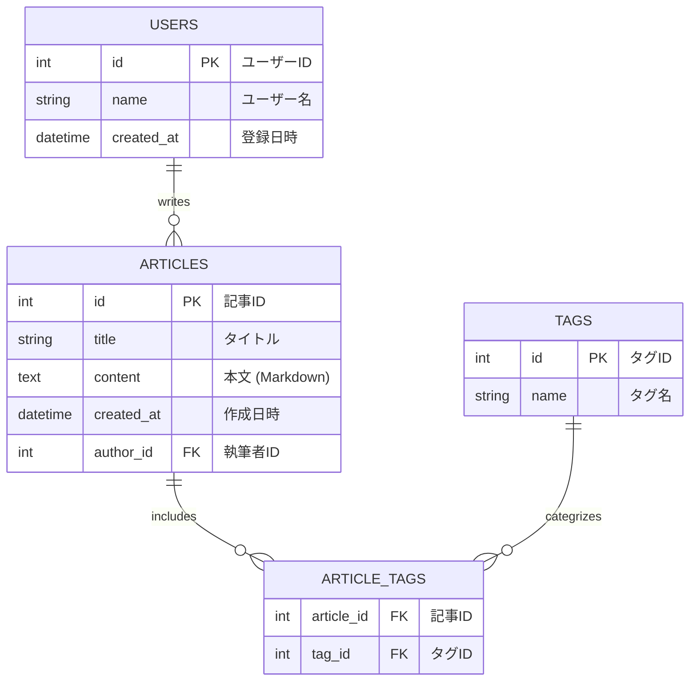

# term1 の DB 定義

```mermaid
erDiagram
  USERS {
    int id PK "ユーザーID"
    string name "ユーザー名"
    datetime created_at "登録日時"
  }

  ARTICLES {
    int id PK "記事ID"
    string title "タイトル"
    text content "本文 (Markdown)"
    datetime created_at "作成日時"
    int author_id FK "執筆者ID"
  }

  TAGS {
    int id PK "タグID"
    string name "タグ名"
  }

  ARTICLE_TAGS {
    int article_id FK "記事ID"
    int tag_id FK "タグID"
  }

  USERS ||--o{ ARTICLES : writes
  ARTICLES ||--o{ ARTICLE_TAGS : includes
  TAGS ||--o{ ARTICLE_TAGS : categrizes
```
