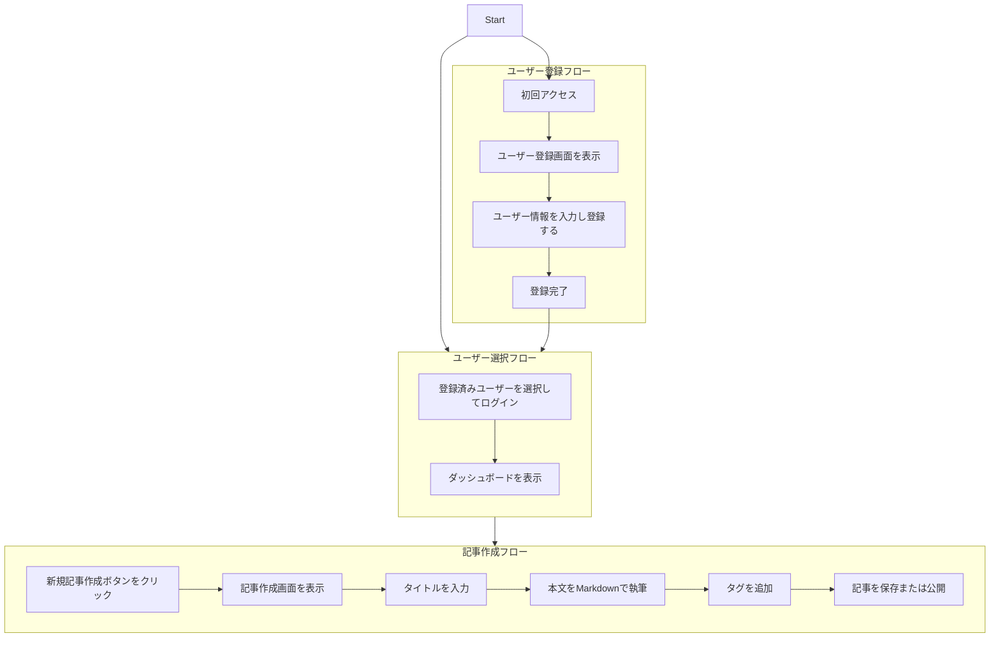

# term1 の要件定義

## 機能要件

- 初回アクセス時に、ユーザー登録できる。
- 登録後、記事を markdown で書くことができる
  - 記事は以下の要素を持つ。
    - タイトル
    - 作成日時
    - 執筆者
    - タグ

## フロー

```mermaid
flowchart TB
    Start --> SignupStart
    Start --> UserSelectionFlow
    SignupEnd --> UserSelectionFlow
    UserSelectionFlow --> ArticleFlow

    subgraph SignupFlow [ユーザー登録フロー]
        SignupStart[初回アクセス]
        B[ユーザー登録画面を表示]
        C[ユーザー情報を入力し登録する]
        SignupEnd[登録完了]
        SignupStart --> B --> C --> SignupEnd
    end

    subgraph UserSelectionFlow [ユーザー選択フロー]
      direction TB
      ArticleStart[登録済みユーザーを選択してログイン]
      F[ダッシュボードを表示]
      ArticleStart --> F
    end

    subgraph ArticleFlow [記事作成フロー]
        G[新規記事作成ボタンをクリック]
        H[記事作成画面を表示]
        I[タイトルを入力]
        J[本文をMarkdownで執筆]
        K[タグを追加]
        L[記事を保存または公開]
        G --> H --> I --> J --> K --> L
    end

```
