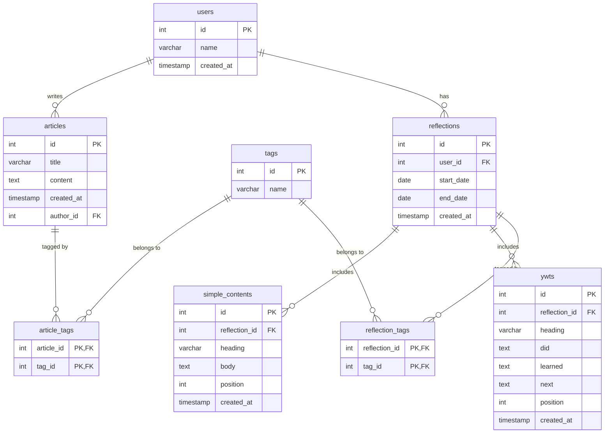

# ER 図

```mermaid
erDiagram

%% --- Term1 ---
users {
    int id PK
    varchar name
    timestamp created_at
}

articles {
    int id PK
    varchar title
    text content
    timestamp created_at
    int author_id FK
}

tags {
    int id PK
    varchar name
}

article_tags {
    int article_id PK, FK
    int tag_id PK, FK
}

%% --- Term2 ---
reflections {
    int id PK
    int user_id FK
    date start_date
    date end_date
    timestamp created_at
}

simple_contents {
    int id PK
    int reflection_id FK
    varchar heading
    text body
    int position
    timestamp created_at
}

ywts {
    int id PK
    int reflection_id FK
    varchar heading
    text did
    text learned
    text next
    int position
    timestamp created_at
}

reflection_tags {
    int reflection_id PK, FK
    int tag_id PK, FK
}

%% --- Relationships ---
users ||--o{ articles : "writes"
articles ||--o{ article_tags : "tagged by"
tags ||--o{ article_tags : "belongs to"

users ||--o{ reflections : "has"
reflections ||--o{ simple_contents : "includes"
reflections ||--o{ ywts : "includes"
reflections ||--o{ reflection_tags : "tagged by"
tags ||--o{ reflection_tags : "belongs to"

```
